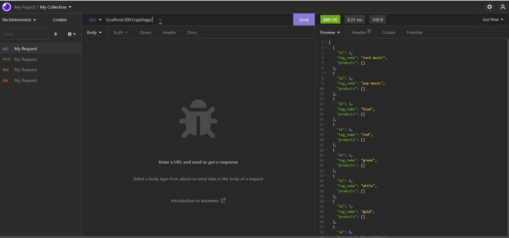

# E-commerce Backend

## Video Walkthrough
https://youtu.be/3lLjXxWZeG4

## Summary
NodeJS-based e-commerce backend application. 
  

## Description 
An application for seeding, updating, and modifying e-commerce data. 

Using Node and npm extensions: the application is seeded with preliminary product-related data. 

Using Insomnia: This data can be viewed and modified.
  

## Instructions

### Pre-requisites
Visual Studio to run code. 
Node.js installed
MySQL installed
Insomnia installed
 

### NPM Installations
NPM install: express, mysql2, sequelize, dotenv
 

### Execution: Seeding from root and Execution
Use MySQL to run 'source db/schema.sql' and establish database. 
Run 'node seeds/index.js' to seed database.   
 

### Execution: Insomnia
Use the following method/address combinations to access/edit the application database:

Access all products, categories or tags: 
GET: http://localhost:3001/api/products 
GET: http://localhost:3001/api/categories 
GET: http://localhost:3001/api/tags 
 
Access individual product, category, or tag, where X is the id of the item: 
GET: http://localhost:3001/api/products/X 
GET: http://localhost:3001/api/categories/X 
GET: http://localhost:3001/api/tags/X 
 
Post new product, category, or tag: 
POST: http://localhost:3001/api/products 
POST: http://localhost:3001/api/categories 
POST: http://localhost:3001/api/tags 
 
Update product, category, or tag, where x is the id of the item: 
PUT: http://localhost:3001/api/products/X 
PUT: http://localhost:3001/api/categories/X 
PUT: http://localhost:3001/api/tags/X 
 
Delete product, category, or tag, where x is the id of the item: 
DELETE: http://localhost:3001/api/products/X 
DELETE: http://localhost:3001/api/categories/X 
DELETE: http://localhost:3001/api/tags/X 
 

## Contact
grimdango@gmail.com
 
## Log 

### 19/03/22
Completed. Added README. Cleaned up code. 

### 10-17/03/22
Adding and fixing routes.

### 08/03/22
Initiated project

   

